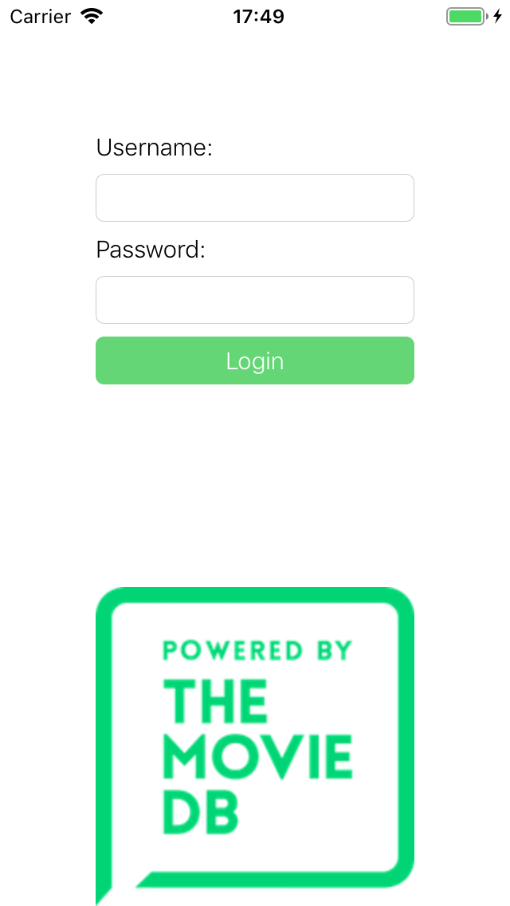
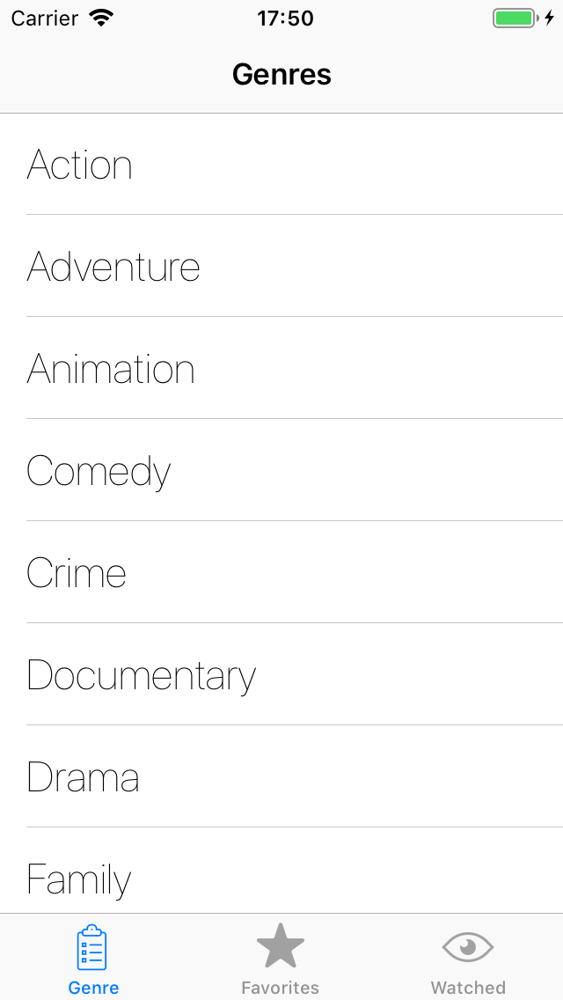
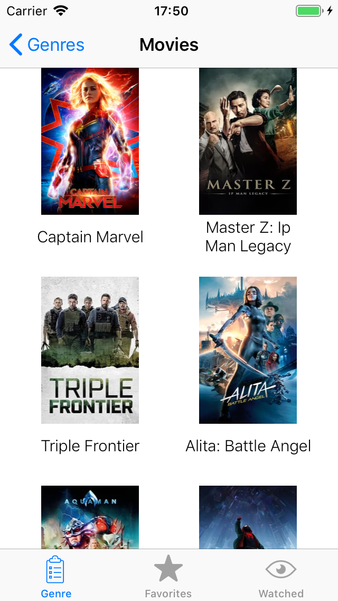
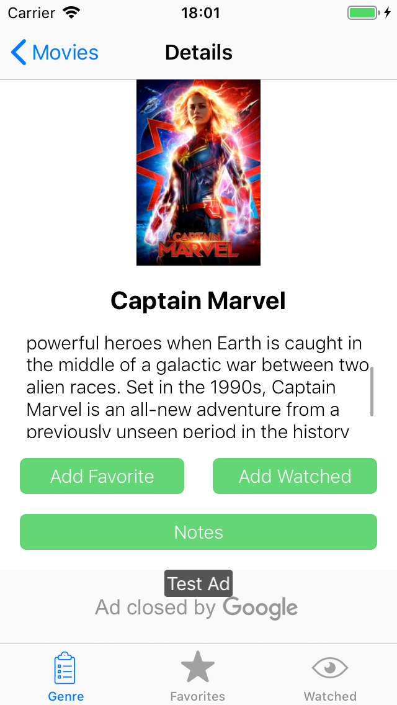
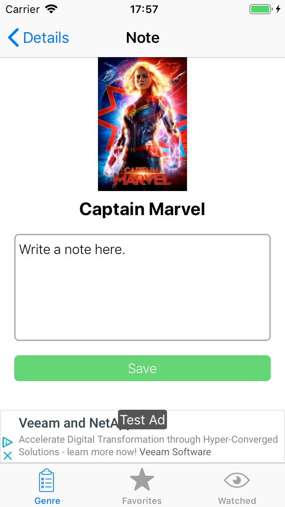
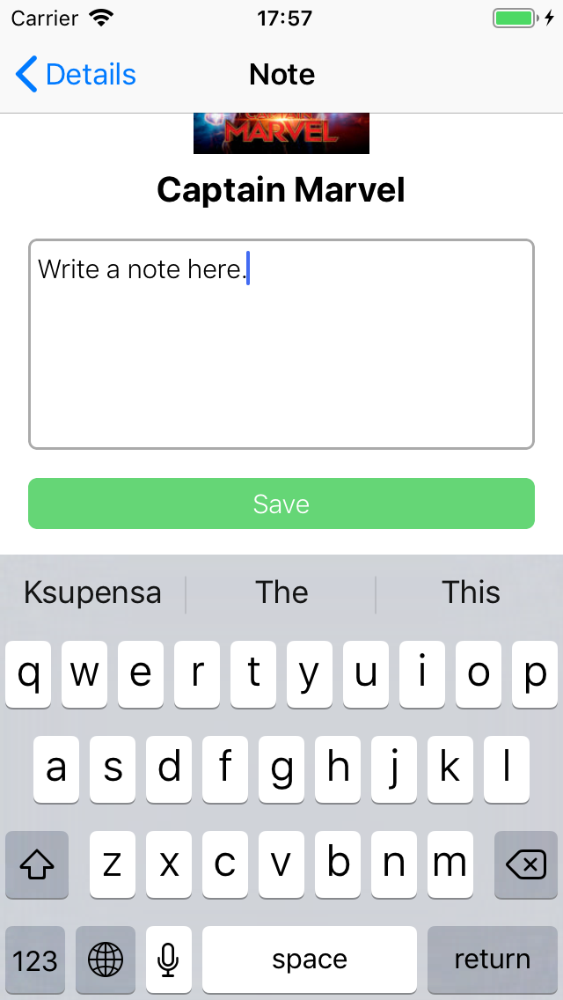
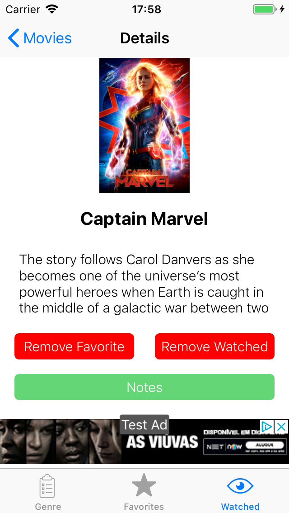
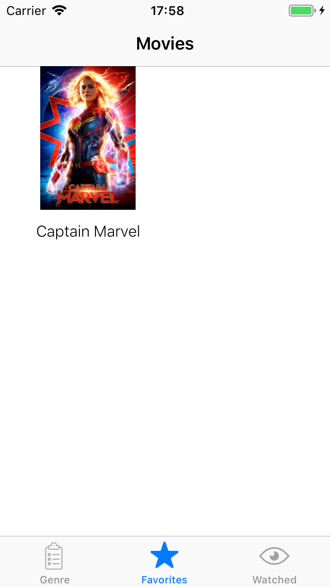

#  OpenClassrooms - iOS developer path - iOS Project 9
## PopCornSwirl - Portrait (iPhones and iPads)
## Core Data - Alamofire - GoogleAdMob

This application uses ["themoviedb" webservice.](https://developers.themoviedb.org/3).
The user first needs to create an account on their website in oreder to use this application.

 

This application allows the user to add/remove movies in their watched and/or favorite list using the webservice.
The user can write a note for a movie. These notes are saved locally using Core Data.

## Login Screen

 

## Genre Screen
The user first selects a particular genre from a list.  

 

Then the user selects a particular movie from that genre. 

 

The user will see the details of the selected movie with an ad banner displayed on the bottom.  
The user can decides to tap on the "Notes" button 

 

The user can add an note for the selected movie.  

 

The layout of the app is changed according to the keyboard. 

 

## Watch and Favorite list
The user can add a movie from the watch and/or favorite list by tapping on "Add Favorite" / "Add Watched" buttons.  
Those buttons change color and text so the user can tap them again the remove the movie from those lists.

 

 
